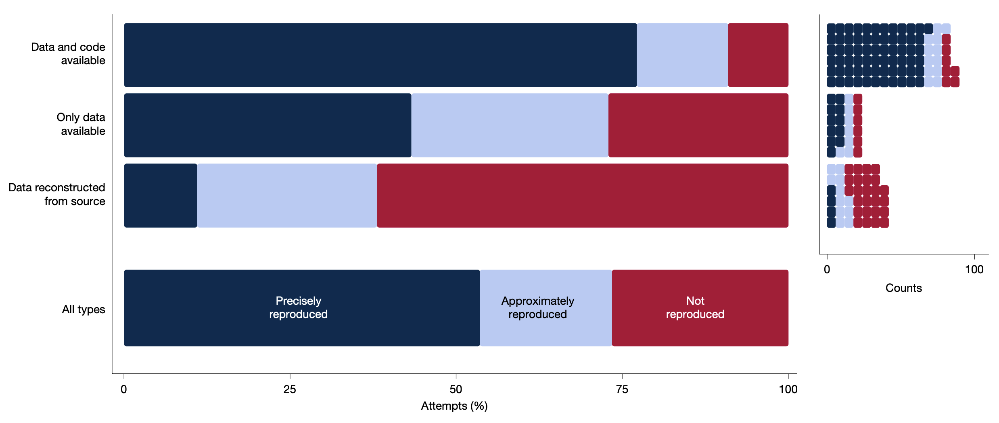

# Preliminaries

---

```{r}
#> label: "fig-lecture-notes-qr-code"
#> fig-cap: "https://psu-psychology.github.io/psy-543-clinical-research-methods-2026/"
talk_qr <- qrcode::qr_code("https://psu-psychology.github.io/psy-543-clinical-research-methods-2026/")
plot(talk_qr)
```

<https://psu-psychology.github.io/psy-543-clinical-research-methods-2026/>

## About me

- B.A., Cognitive Science, Brown University
- M.S. & Ph.D., Psychology (Cognitive Neuroscience), Carnegie Mellon University
- Penn State 1997-
- Human brain development, perception & action, computational modeling, machine vision, big data, open science

---

- Founding Director of Human Imaging, Penn State Social, Life & Engineering Sciences Imaging Center (SLEIC)
- Co-Founder/Co-Director of [Databrary.org](https://databrary.org) data library
- [gilmore-lab.github.io](https://gilmore-lab.github.io)

---

- banjo & harmonica player, actor, cyclist, backpacker, paddler, poet, ham ([W3TM](https://w3tm.org)), amateur astronomer
- Judge of Elections (Precinct 26, State College East 3)
- native Coloradoan, husband, dad, grandpa

---

:::: {.columns}
::: {.column width=50%}
>...And so you see, I have come to doubt / All that I once held as true...

:::
::: {.column width=50%}
::: {#fig-kathys-song}
<iframe width="560" height="315" src="https://www.youtube.com/embed/0faGrAq5C5o?si=KzZP38M-Tz8SfOOi" title="YouTube video player" frameborder="0" allow="accelerometer; autoplay; clipboard-write; encrypted-media; gyroscope; picture-in-picture; web-share" referrerpolicy="strict-origin-when-cross-origin" allowfullscreen></iframe>

@PaulSimonVEVO2021-ub
:::
:::
::::

## Acknowledgements

Thank you to NICHD, NIMH, NIDA, NIH OD, NSF, the Alfred P. Sloan Foundation, the James S. McDonnell Foundation, the LEGO Foundation, and the John S. Templeton Foundation.

## Agenda

- Here's a story...
- Some questions to ponder

# Here's a story

---

::: {#fig-data-snafus-video}
<iframe width="1280" height="450" src="https://www.youtube.com/embed/66oNv_DJuPc?si=Cn7PNrGvOVEUCaPV" title="YouTube video player" frameborder="0" allow="accelerometer; autoplay; clipboard-write; encrypted-media; gyroscope; picture-in-picture; web-share" referrerpolicy="strict-origin-when-cross-origin" allowfullscreen></iframe>

@NYU_Health_Sciences_Library2013-gp
:::

# Some questions to ponder

## Where do you store your research data?

{#fig-psu-survey-data-storage width="60%"}

---

{#fig-oransky-2023}

---

{#fig-nyt-tessier-lavigne fig-align="center"}

---

{#fig-gino-research}

---


---



---

](https://www.pewresearch.org/science/wp-content/uploads/sites/16/2023/11/PS_2023.11.14_trust-in-scientists_00-01.png){#fig-sci-positive-effect fig-align="center" width="60%"}

---

](https://www.pewresearch.org/science/wp-content/uploads/sites/16/2023/11/PS_2023.11.14_trust-in-scientists_00-04.png){#fig-sci-worthwhile-for-society fig-align="center"}

## More questions to ponder

---

### What proportion of findings in the published scientific literature (in the fields you care about) are *actually true*?

-   100%
-   90%
-   70%
-   50%
-   30%

## How do we define what "*actually true*" means?

---

### Is there a reproducibility crisis in science?

-   Yes, a significant crisis
-   Yes, a slight crisis
-   No crisis
-   Don't know

------------------------------------------------------------------------

::: {layout-ncol=2}
{#fig-baker-2016-crisis width="100%"}

{#fig-psu-survey-crisis}
:::

## {.scrollable}

:::: {.columns}
::: {.column width="50%"}
### Have you failed to reproduce an analysis from your lab or someone else's?
:::

::: {.column width="50%"}
{.lightbox width="75%"}
:::
::::

## Does this surprise you?

## {.scrollable}

:::: {.columns}
::: {.column width="50%"}
### What factors contribute to irreproducible research?
:::
::: {.column width="50%"}
{.lightbox width="87%"}
:::
::::

---



## Do you agree or disagree with Mischel?

- Do we treat other people's theories like toothbrushes?
- Are we building a cumulative psychological science?
- Should we be?
- If so, how?

## What is our quest?

{fig-align="center"}

## Straw, sticks, or

{fig-align="center"}

## Stone?

{fig-align="center"}

---



## Reactions to Feynmann

- Are you fooling yourself? Are others?
- Is that bad? How do we avoid it?
- Do scientists have an obligation to 'bend over backwards' to show how they might be wrong?
- Should all results, null or contradictory to a prediction be published?
- Why or why not?

# The three R's

## Pillars

- Findings should be *reproducible*
  - Same data, same code, same results
- Findings should be *robust*
  - Same data, new analysis, comparable results
- Findings should be *replicable*
  - New data, comparable results

---

{#fig-miske-2026-abstr}

---

{#fig-miske-2026-fig-01}

---

{#fig-miske-2026-fig-02}

---

{#fig-miske-2026-fig-03}

---

{#fig-miske-2026-fig-04}

---

{#fig-miske-2026-fig-05}

## @Miske2026-kh

>...The authors of 144 (24.0%, 95% confidence
interval (CI)=20.8–27.6%) papers made data available to assess reproducibility and,
for 38 others, we obtained source data to reconstruct the dataset. 

## @Miske2026-kh

>We assessed 143 out of the 182 available datasets and found that 76.6 (53.6%, 95% CI=45.8–60.7%)
papers were rated as precisely reproducible and 105.0 (73.5%, 95% CI=66.4–80.0%)
were rated as at least approximately reproducible (within 15% of the original effects
or within 0.05 of original P values) after inverse weighting each of the 551 claims by
the number of claims per paper. 

## @Miske2026-kh

>We observed higher reproducibility for papers from
political science and economics compared with other fields, for more recent papers
compared with older papers and for papers from journals that require data sharing.
Implementation of measures to verify that research is reproducible is needed to
support trustworthiness in the complex enterprise of knowledge production 3,4.

---


## @Aczel2026-kx


---


---


# Looking forward

## Gilmore's experiences

:::: {.columns}
::: {.column width=50%}
::: {.incremental}
- Plan your work, work your plan
- Murphy's Laws are never broken
- Quick & dirty is...both
:::
:::
::: {.column width=50%}
::: {.incremental}
- DRY WIT
  - **D**on't **R**epeat **Y**ourself
  - **W**rite **I**t **D**own
- Seeing is believing: Plot your data
:::
:::
::::

## Open Science @ Penn State

-  [Bootcamp 2026](https://penn-state-open-science.github.io/bootcamp-2026/)
  - May 11-12
  - [Register](https://forms.gle/myMCqAZsAHXQBy4n7)
- [Bootcamp 2025](https://penn-state-open-science.github.io/bootcamp-2025/)
- [Bootcamp 2023](https://penn-state-open-science.github.io/bootcamp-2023/)

## Open Science @ Penn State

- Data management workshops
- Speakers
- Blog/website (<https://penn-state-open-science.github.io/>)
- List: l-open-science@lists.psu.edu

# Summing up

---

{fig-align="center"}

---

{fig-align="center"}

---

{fig-align="center"}

---


---

![@Unknown2018-kx aka "Rosie the Riveter"^["The 'We Can Do It!' poster appeared in a few factories in 1943. By J. Howard Miller - U.S. National Archives and Records Administration, Public Domain, https://commons.wikimedia.org/w/index.php?curid=80242715"]](https://upload.wikimedia.org/wikipedia/commons/thumb/d/df/We_Can_Do_It%21_NARA_535413_-_Restoration_2.jpg/1280px-We_Can_Do_It%21_NARA_535413_-_Restoration_2.jpg){#fig-rosie width="40%"}

---

<p style="text-align:center;">
### A conversation about open science

*Let's keep talking...*</br>
</br></br></br>
**Rick Gilmore**</br>
rog1 AT-SYMBOL psu PERIOD edu</br>
114 Moore</br>
[github.com/gilmore-lab](https://github.com/gilmore-lab)</br>
[github.com/psu-psychology](https://github.com/psu-psychology)</br>
[github.com/penn-state-open-science](https://github.com/penn-state-open-science)
</p>

# Resources

## Code {.scrollable}

This talk was produced on `r Sys.Date()` in [RStudio](http://rstudio.com) using [Quarto](https://quarto.org) and the [revealJS](https://quarto.org/docs/presentations/revealjs/) framework.

The code and materials used to generate the slides may be found at <https://github.com/psu-psychology/psy-543-clinical-research-methods-2026/>.
Information about the R Session that produced the code is as follows:

```{r session-info}
sessionInfo()
```

## References
