# Preliminaries

---

```{r}
#> label: "fig-lecture-notes-qr-code"
#> fig-cap: "https://psu-psychology.github.io/psy-543-clinical-research-methods-2026/"
talk_qr <- qrcode::qr_code("https://psu-psychology.github.io/psy-543-clinical-research-methods-2026/")
plot(talk_qr)
```

<https://psu-psychology.github.io/psy-543-clinical-research-methods-2026/>

## About me

- B.A., Cognitive Science, Brown University
- M.S. & Ph.D., Psychology (Cognitive Neuroscience), Carnegie Mellon University
- Penn State 1997-
- Human brain development, perception & action, computational modeling, machine vision, big data, open science

---

- Founding Director of Human Imaging, Penn State Social, Life & Engineering Sciences Imaging Center (SLEIC)
- Co-Founder/Co-Director of [Databrary.org](https://databrary.org) data library
- [gilmore-lab.github.io](https://gilmore-lab.github.io)

---

- banjo & harmonica player, actor, cyclist, backpacker, paddler, poet, ham ([W3TM](https://w3tm.org)), amateur astronomer
- Judge of Elections (Precinct 26, State College East 3)
- native Coloradoan, husband, dad, grandpa

---

:::: {.columns}
::: {.column width=50%}
>...And so you see, I have come to doubt / All that I once held as true...

:::
::: {.column width=50%}
::: {#fig-kathys-song}
<iframe width="560" height="315" src="https://www.youtube.com/embed/0faGrAq5C5o?si=KzZP38M-Tz8SfOOi" title="YouTube video player" frameborder="0" allow="accelerometer; autoplay; clipboard-write; encrypted-media; gyroscope; picture-in-picture; web-share" referrerpolicy="strict-origin-when-cross-origin" allowfullscreen></iframe>

@PaulSimonVEVO2021-ub
:::
:::
::::

## Acknowledgements

Thank you to NICHD, NIMH, NIDA, NIH OD, NSF, the Alfred P. Sloan Foundation, the James S. McDonnell Foundation, the LEGO Foundation, and the John S. Templeton Foundation.

## Agenda

- Here's a story...
- Some questions to ponder
- The three R's
- Looking forward

# Here's a story

---

::: {#fig-data-snafus-video}
<iframe width="1280" height="450" src="https://www.youtube.com/embed/66oNv_DJuPc?si=Cn7PNrGvOVEUCaPV" title="YouTube video player" frameborder="0" allow="accelerometer; autoplay; clipboard-write; encrypted-media; gyroscope; picture-in-picture; web-share" referrerpolicy="strict-origin-when-cross-origin" allowfullscreen></iframe>

@NYU_Health_Sciences_Library2013-gp
:::

# Some questions to ponder

## Where do you store research data?

{#fig-psu-survey-data-storage width="60%"}

---

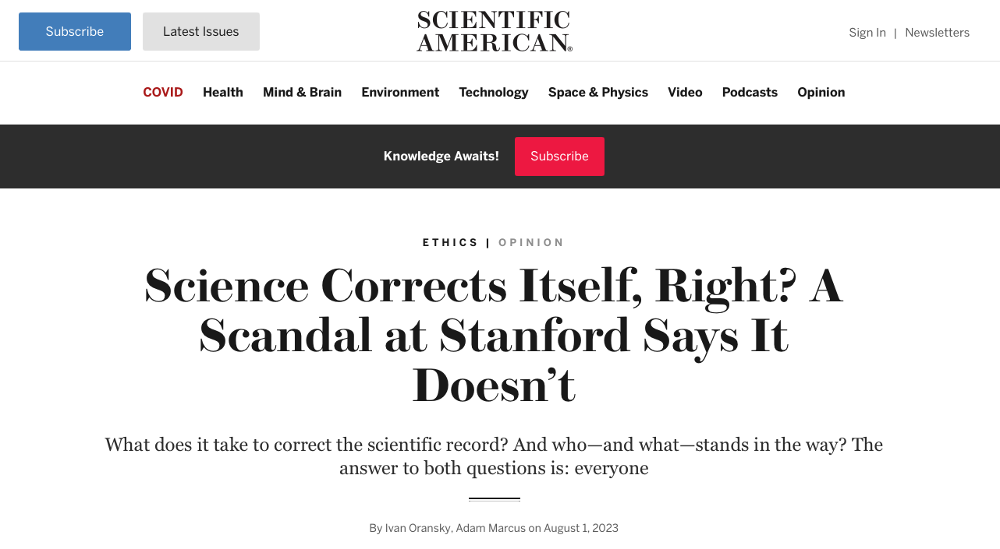{#fig-oransky-2023}

---

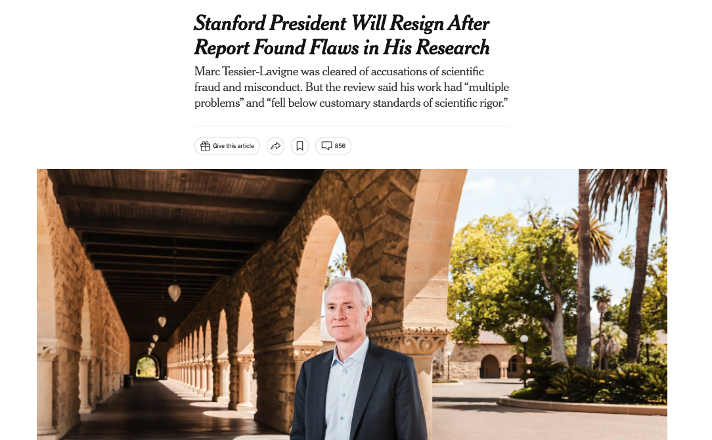{#fig-nyt-tessier-lavigne fig-align="center"}

---

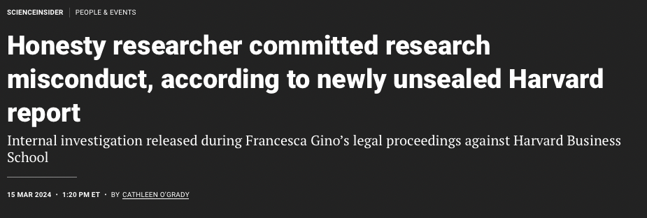{#fig-gino-research}

---

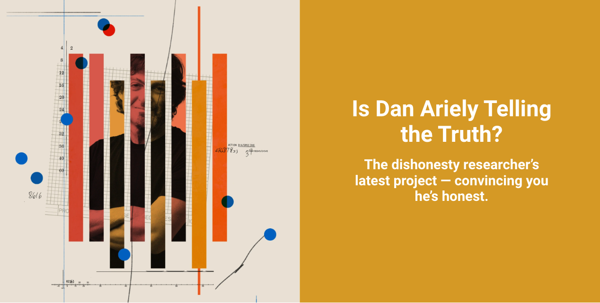{#fig-arielty-telling}

---



---

](https://www.pewresearch.org/science/wp-content/uploads/sites/16/2023/11/PS_2023.11.14_trust-in-scientists_00-01.png){#fig-sci-positive-effect fig-align="center" width="60%"}

---

](https://www.pewresearch.org/science/wp-content/uploads/sites/16/2023/11/PS_2023.11.14_trust-in-scientists_00-04.png){#fig-sci-worthwhile-for-society fig-align="center"}

---

### What proportion of findings in the published scientific literature (in the fields you care about) are *actually true*?

-   100%
-   90%
-   70%
-   50%
-   30%

---

### How do we define what "*actually true*" means?

---

### Is there a reproducibility crisis in science?

-   Yes, a significant crisis
-   Yes, a slight crisis
-   No crisis
-   Don't know


---

:::: {.columns}
::: {.column width=50%}
{#fig-baker-2016-crisis width="100%"}

:::
::: {.column width=50%}

::: {.fragment}
{#fig-psu-survey-crisis}
:::

:::
::::

## {.scrollable}

:::: {.columns}
::: {.column width="50%"}
### Have you failed to reproduce an analysis from your lab or someone else's?
:::

::: {.column width="50%"}
{.lightbox width="75%" #fig-baker-f}
:::
::::

---

:::: {.columns}
::: {.column width=50%}
::: {.incremental}
- Selective reporting
- Pressure to publish
- Low statistical power
- Not replicated enough in original lab
- Insufficient oversight/mentoring
- Data, methods, code not available
:::
:::
::: {.column width=50%}
{#fig-baker-g .lightbox}

:::
::::

---



---

### Do you agree or disagree with Mischel?

- Do we treat other people's theories like toothbrushes?
- Are we building a cumulative psychological science?
- Should we be?
- If so, how?

---

{fig-align="center"}

## Straw, sticks, or

{fig-align="center"}

## Stone?

{fig-align="center"}

---



## Reactions to Feynmann

- Are you fooling yourself? Are others?
- Is that bad? How do we avoid it?
- Do scientists have an obligation to 'bend over backwards' to show how they might be wrong?
- Should all results, null or contradictory to a prediction be published?
- Why or why not?

# The three R's

---

- Findings should be *reproducible*
  - Same data, same code, same results
- Findings should be *robust*
  - Same data, new analysis, comparable results & conclusions
- Findings should be *replicable*
  - New data, comparable results & conclusions

---

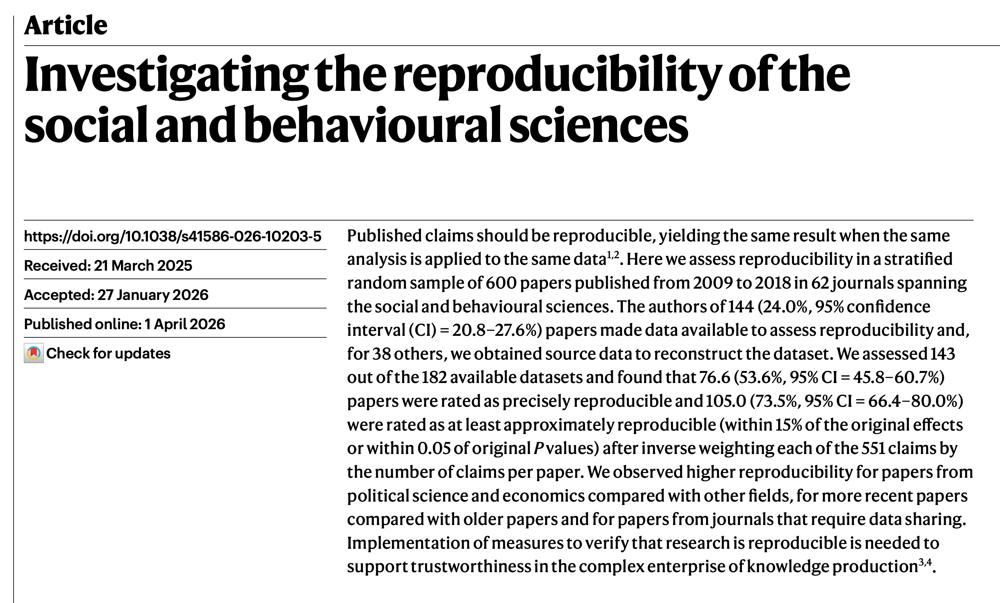{#fig-miske-2026-abstr}

---

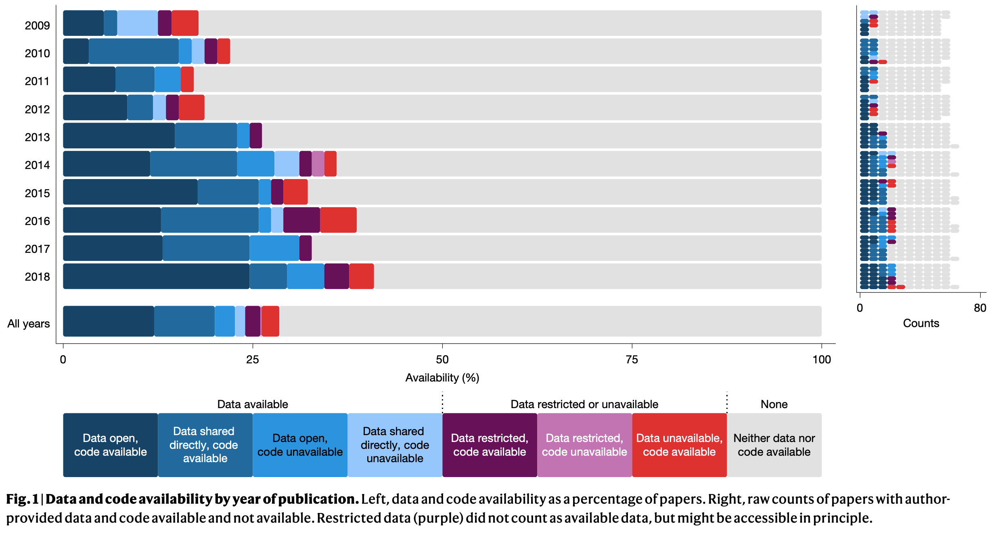{#fig-miske-2026-fig-01}

---

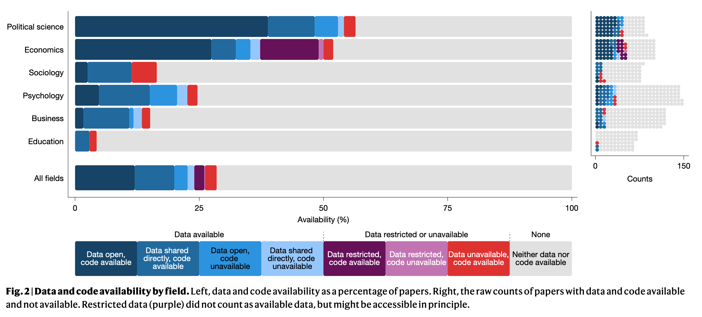{#fig-miske-2026-fig-02}

---

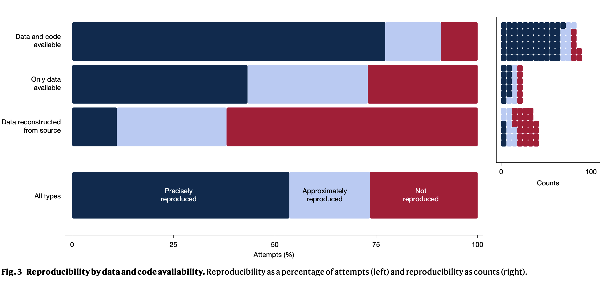{#fig-miske-2026-fig-03}

---

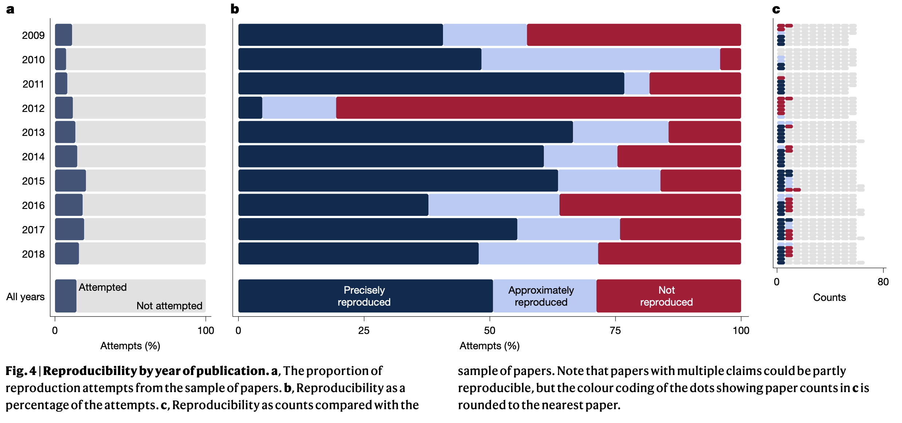{#fig-miske-2026-fig-04}

---

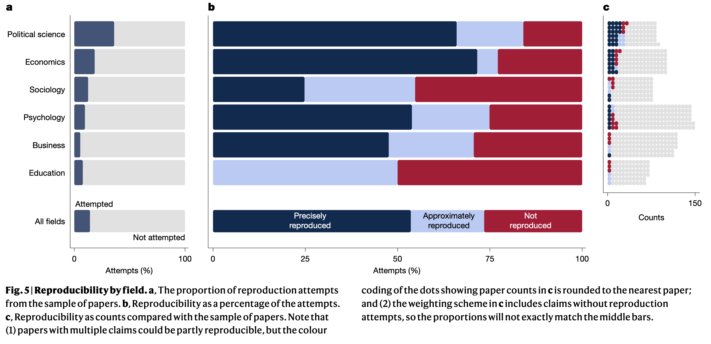{#fig-miske-2026-fig-05}

## @Miske2026-kh

>...The authors of **144 (24.0%, 95% confidence
interval (CI)=20.8–27.6%)** papers made data available to assess reproducibility and,
for 38 others, we obtained source data to reconstruct the dataset.

## @Miske2026-kh

>We assessed 143 out of the 182 available datasets and found that 76.6 (**53.6%**, 95% CI=45.8–60.7%)
**papers were rated as precisely reproducible** and 105.0 (73.5%, 95% CI=66.4–80.0%)
were rated as at least approximately reproducible (within 15% of the original effects
or within 0.05 of original P values) after inverse weighting each of the 551 claims by
the number of claims per paper.

## @Miske2026-kh

>We assessed 143 out of the 182 available datasets and found that 76.6 (53.6%, 95% CI=45.8–60.7%)
papers were rated as precisely reproducible and 105.0 (**73.5%**, 95% CI=66.4–80.0%)
**were rated as at least approximately reproducible** (within 15% of the original effects
or within 0.05 of original P values) after inverse weighting each of the 551 claims by
the number of claims per paper.

## @Miske2026-kh

>We observed **higher reproducibility for papers from political science and economics** compared with other fields, for more recent papers compared with older papers and for papers from journals that require data sharing. Implementation of measures to verify that research is reproducible is needed to support trustworthiness in the complex enterprise of knowledge production 3,4.

## @Miske2026-kh

>We observed higher reproducibility for papers from political science and economics compared with other fields, for more recent papers compared with older papers and for papers from journals that require data sharing. **Implementation of measures to verify that research is reproducible is needed to support trustworthiness in the complex enterprise of knowledge production** 3,4.

## Questions to ponder

::: {.incremental}
- Twenty-four percent of authors approached made data available to @Aczel2026-kx. Any comments? 
- Do you agree that "measures to verify that research is reproducible [are] needed to support trustworthiness"?
  - Why or why not?

:::

---

:::: {.columns}
::: {.column width=50%}
{#fig-baker-2016-fig-i}
:::
::: {.column width=50%}
- Are *your*/*your lab group's* findings reproducible?
  - How do you know?
- Do you require other lab group members to redo analyses?

::: {.callout-important}
## Verify then publish
Some journals require pre-publication verification
:::
:::
::::

---

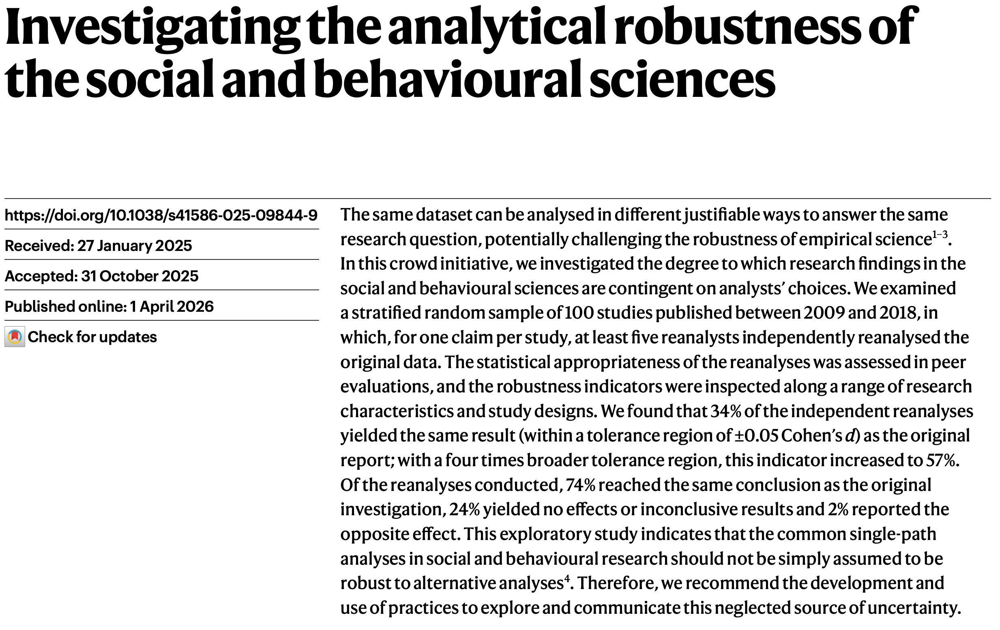

---

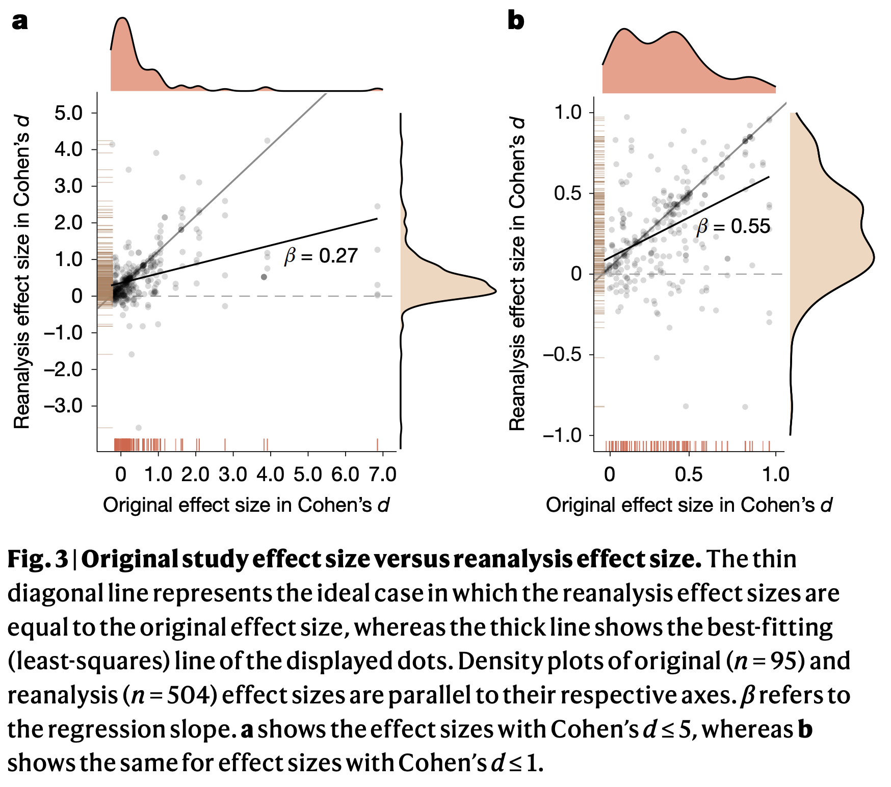

## @Aczel2026-kx

>We found that 34% of the independent reanalyses yielded the same result (within a tolerance region of ±0.05 Cohen’s d) as the original report; with a four times broader tolerance region, this indicator increased to 57%. Of the reanalyses conducted, 74% reached the same conclusion as the original investigation, 24% yielded no effects or inconclusive results and 2% reported the opposite effect. 

## @Aczel2026-kx

>This exploratory study indicates that the common single-path analyses in social and behavioural research should not be simply assumed to be robust to alternative analyses.

## Questions to ponder

::: {.incremental}
- What do you think about "multiverse" analyses?
- Should robust empirical findings be detectable via multiple, alternative analyses?
  - Why or why not?
- What does it mean when 1/3 of independent reanalyses "yielded the same result...as the original report"? 
- What does it mean when 1/4 yielded no effects or the opposite effect?

:::
 
---

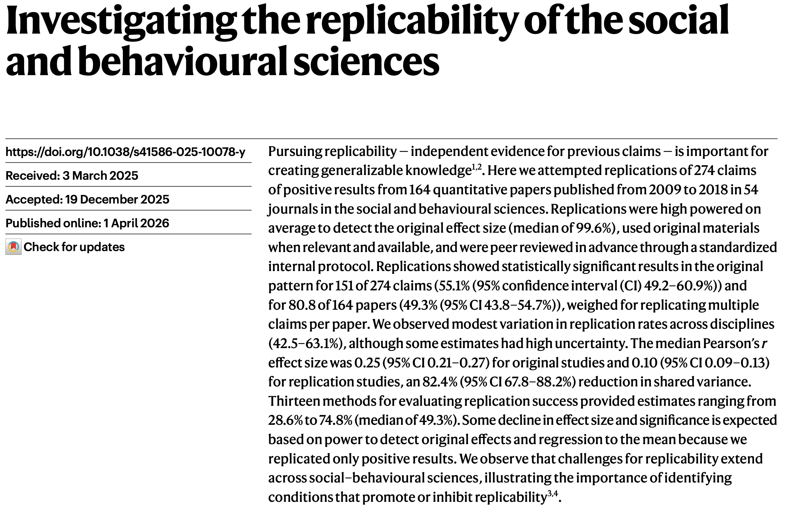

---

:::: {.columns}
::: {.column width=60%}
>Replications showed statistically significant results in the original pattern for 151 of 274 claims (55.1% (95% confidence interval (CI) 49.2–60.9%)) and for 80.8 of 164 papers (49.3% (95% CI 43.8–54.7%)), weighed for replicating multiple claims per paper.

-- @Tyner2026-wt
:::
::: {.column width=40%}

:::
::::

## Questions to ponder

::: {.incremental}
- What proportion of findings in the published scientific literature (in the fields you care about) are *actually true*?
- How does a finding's *replicability* relate to whether a finding is *actually true*? 
- What does the (taxpaying, research funding) public expect?
:::

# Looking forward

## {background-color="black"}

---

<iframe src="https://ourworldindata.org/grapher/child-mortality?tab=line" loading="lazy" style="width: 100%; height: 550px; border: 0px none;" allow="web-share; clipboard-write"></iframe>

@UnknownUnknown-lz

---

<iframe src="https://ourworldindata.org/grapher/life-expectancy?tab=line" loading="lazy" style="width: 100%; height: 550px; border: 0px none;" allow="web-share; clipboard-write"></iframe>

@UnknownUnknown-ay

---

<iframe src="https://ourworldindata.org/grapher/share-with-mental-and-substance-disorders?country=OWID_LIC~OWID_HIC~OWID_LMC~OWID_UMC&tab=map" loading="lazy" style="width: 100%; height: 550px; border: 0px none;" allow="web-share; clipboard-write"></iframe>

@UnknownUnknown-xw

## Science as a system of values

:::: {.columns}
::: {.column width=50%}
- Evidence
- Reproducibility, Robustness, Replicability
- Rigor, Reliability, Reach
- Transparency, Openness, Honesty
:::
::: {.column width=50%}
::: {.fragment}
{width="60%"}
:::
:::
::::

---

![@Wikipedia-contributors2025-yz^["Seven blind men and an elephant parable at a Jain temple. By romana klee from usa - sammati tarka prakarana, CC BY-SA 2.0, https://commons.wikimedia.org/w/index.php?curid=59461928"]](https://upload.wikimedia.org/wikipedia/commons/e/ed/Medieval_Jain_temple_Anekantavada_doctrine_artwork.jpg){width="70%"}

## Open Science @ Penn State

-  [Bootcamp 2026](https://penn-state-open-science.github.io/bootcamp-2026/)
  - May 11-12
  - [Register](https://forms.gle/myMCqAZsAHXQBy4n7)
- [Bootcamp 2025](https://penn-state-open-science.github.io/bootcamp-2025/)
- [Bootcamp 2023](https://penn-state-open-science.github.io/bootcamp-2023/)

## Open Science @ Penn State

- Data management workshops
- Speakers
- Blog/website (<https://penn-state-open-science.github.io/>)
- List: l-open-science@lists.psu.edu

---


---

## Reproducibility first

:::: {.columns}
::: {.column width=40%}
- Document your workflows
- Attend to data quality
  - Garbage in/garbage out
:::
::: {.column width=60%}
{fig-align="right" width="60%"}
:::
::::

## Reproducibility first

:::: {.columns}
::: {.column width=50%}
- DRY WIT
  - **Don't** **R**epeat **Y**ourself
  - **W**rite **I**t **D**own
- Automate your workflows
- Visualize before you analyze
:::
::: {.column width=50%}
{width="200px"} \
{width="200px" fig-align="right"} \
{width="100px" fig-align="right"} \
{width="100px" fig-align="right"} 
:::
::::

## Plan your work; work your plan

::: {.incremental}
- Plan to share
  - Get IRB approval
  - Get participant permission
  - Consider restricted access repositories (e.g., Databrary)
- Embed data cleaning, curation into ongoing workflows
  - Organize with a view toward data reuse

:::

# Summing up

---

{fig-align="center"}

---

{fig-align="center"}

---

{fig-align="center"}

---

![@Unknown2018-kx aka "Rosie the Riveter"^["The 'We Can Do It!' poster appeared in a few factories in 1943. By J. Howard Miller - U.S. National Archives and Records Administration, Public Domain, https://commons.wikimedia.org/w/index.php?curid=80242715"]](https://upload.wikimedia.org/wikipedia/commons/thumb/d/df/We_Can_Do_It%21_NARA_535413_-_Restoration_2.jpg/1280px-We_Can_Do_It%21_NARA_535413_-_Restoration_2.jpg){#fig-rosie width="40%"}

---

<h3 style="text-align:center;">**A conversation about open science**</h3>
<p style="text-align:center;">
*Let's keep talking...*</br>
</br></br></br>
**Rick Gilmore**</br>
rog1 AT-SYMBOL psu PERIOD edu</br>
114 Moore</br>
[github.com/gilmore-lab](https://github.com/gilmore-lab)</br>
[github.com/psu-psychology](https://github.com/psu-psychology)</br>
[github.com/penn-state-open-science](https://github.com/penn-state-open-science)
</p>

# Resources

## Code {.scrollable}

This talk was produced on `r Sys.Date()` in [RStudio](http://rstudio.com) using [Quarto](https://quarto.org) and the [revealJS](https://quarto.org/docs/presentations/revealjs/) framework.

The code and materials used to generate the slides may be found at <https://github.com/psu-psychology/psy-543-clinical-research-methods-2026/>.
Information about the R Session that produced the code is as follows:

```{r session-info}
sessionInfo()
```

## References
